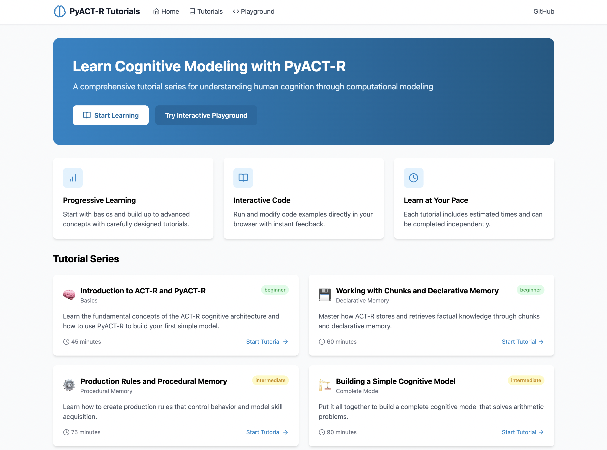

# pyactr-tutorials

Jupyter notebooks for learning cognitive modeling with [pyactr](https://github.com/jakdot/pyactr), a Python implementation of the ACT-R cognitive architecture.

These tutorials are aimed at students and researchers who want to build computational models of human cognition. They cover the core ACT-R mechanisms (declarative memory, production rules, subsymbolic processing) and work up to applied topics like model fitting, language processing, and problem solving.

## Tutorials

| # | Topic | Notebook |
|---|-------|----------|
| 1 | Introduction to ACT-R and pyactr | `01_introduction/` |
| 2 | Chunks and declarative memory | `02_declarative_memory/` |
| 3 | Production rules and procedural memory | `03_production_rules/` |
| 4 | Building a complete cognitive model | `04_building_complete_model/` |
| 5 | Subsymbolic processing | `05_advanced_modeling/` |
| 6 | Decision making (applied) | `06_real_world_application/` |
| 7 | Motor control and timing | `07_motor_timing/` |
| 8 | Vision and attention | `08_vision_attention/` |
| 9 | Learning and skill acquisition | `09_learning/` |
| 10 | Model fitting and parameter estimation | `10_model_fitting/` |
| 11 | Problem solving | `11_problem_solving/` |
| 12 | Language processing | `12_language_processing/` |

Tutorials 1-4 cover the basics. 5-8 go deeper into ACT-R's modules and subsymbolic layer. 9-12 are more applied and assume familiarity with earlier material.

## Setup

Requires Python 3.11+.

```bash
git clone https://github.com/Cognitive-Modeller/pyactr-tutorials.git
cd pyactr-tutorials

# install uv if you don't have it
curl -LsSf https://astral.sh/uv/install.sh | sh

uv sync
uv run jupyter notebook
```

Then open the `notebooks/` directory and start from tutorial 1.

## Companion web app

There's also a web app (`pyactr-webapp/`) with a browser-based code editor for running pyactr code without a local Jupyter setup. See `pyactr-webapp/README.md` for details. It's experimental.




## References

- [pyactr on GitHub](https://github.com/jakdot/pyactr)
- [ACT-R publications](http://act-r.psy.cmu.edu/publications/)
- Anderson, J. R. (2007). *How Can the Human Mind Occur in the Physical Universe?*
- Anderson, J. R., & Lebiere, C. (1998). *The Atomic Components of Thought*

## Troubleshooting

- **Import errors**: Make sure you launch Jupyter via `uv run jupyter notebook` so the venv is active.
- **Chunk type errors**: Chunk types need to be defined before you create chunks of that type.
- **Production parse errors**: pyactr's production syntax doesn't support inline comments or `!output!` directives.

## License

Educational use. Feel free to use and adapt with attribution.
